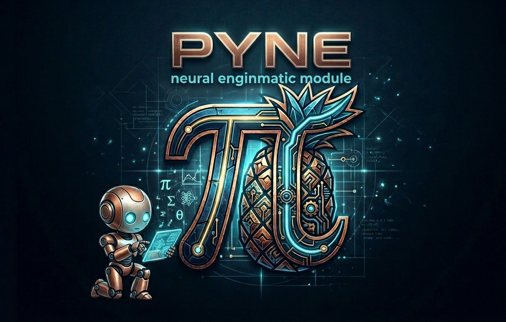

# PYNE  
### *Python Deep Learning Autograd*

> A minimal neural network engine built from scratch in Python, focused on understanding **backpropagation**, **autograd**, and **tensor-based computation**.

---

## Overview
<!-- 1774784081223~2.png -->

  

**PYNE** is an educational deep learning module inspired by micrograd, but instead of scalar-based computation graphs, it operates directly on **tensors** using object-oriented design.

The goal is not performance or production use, but:
- Deep understanding of neural networks
- Experimentation with new ideas
- Building intuition for gradient-based learning
<!-- Simple mindset for debugging NNs-->

---

## Features

- Tensor-based computation (no scalar `Value` objects)
- Automatic differentiation (backpropagation)
- Neural network module system (`nn`)
- Multi-Layer Perceptron (MLP) implementation
- Deep RNNs
- Gradient tracking for all parameters
- Broadcasting support
- Modular and extensible architecture

---

## Project Structure
